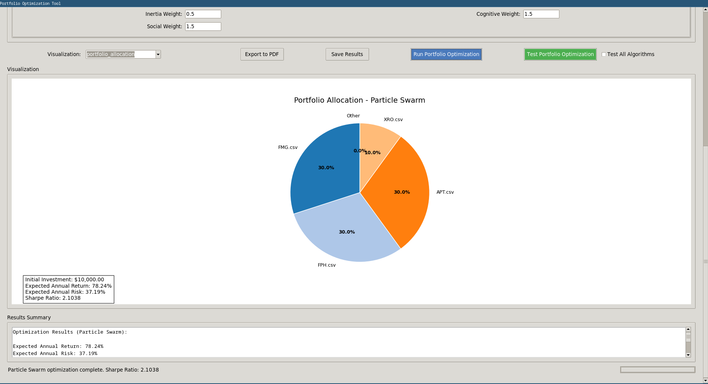
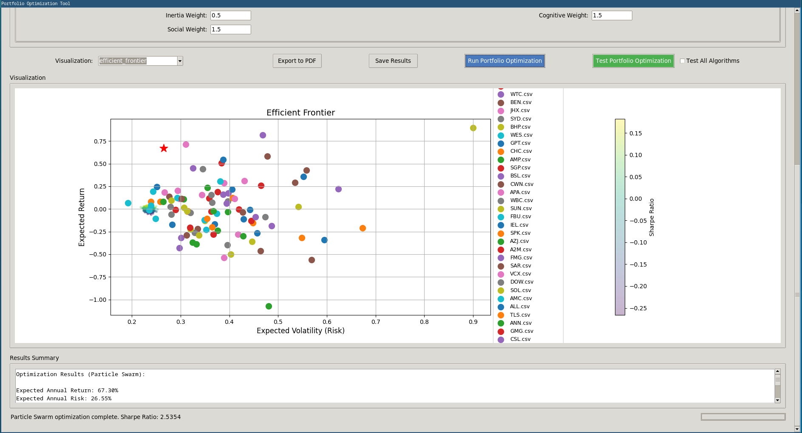

# Portfolio Optimization Tool

## Introduction

The **Portfolio Optimization Tool** is a project aimed at addressing financial portfolio allocation challenges using metaheuristic optimization algorithms. It leverages historical stock price data from the Australian Securities Exchange (ASX) to analyze and optimize portfolios, providing a user-friendly interface for visualization and decision-making. We think that a future roadmap of improvements, would involve making this tool integrate easily with other csv historical data from different datasets and historical market info.

## Project Made with:
   - [João Rebelo](https://github.com/jrebelo08)
   - [Gonçalo Sousa](https://github.com/goncalosousa4)

## GUI Screenshot
<div align="center">

<div> <strong>Image 1:</strong>GUI Interface </div>
</div>
<br>


## Installation

1. Set up a virtual environment:
   ```bash
   python -m venv venv
   ```

2. Activate the virtual environment:
- **Windows**: 
     ```bash
     venv\Scripts\activate
     ```
- **Unix based OS**: 
     ```bash
     source venv/bin/activate
     ```

3. Install dependencies:
   ```bash
   pip install -r requirements.txt
   ```

## Implemented Features

### Optimization Algorithms
The tool includes six meta-heuristic algorithms, each with customizable parameters that allow tinkering with the algorithms :
- **Hill Climbing**: A local search algorithm.
- **Simulated Annealing**: A probabilistic global optimization method.
- **Tabu Search**: A memory-based optimization technique that avoids local optima.
- **Genetic Algorithm**: An evolutionary approach for optimization.
- **Particle Swarm Optimization**: A swarm intelligence-based method.
- **Differential Evolution**: A population-based optimization technique.

| Algorithm            | Type                | Best Use Case             | Key Parameter   |
|----------------------|---------------------|---------------------------|-----------------|
| Hill Climbing        | Local Search        | Quick analysis            | Step size       |
| Simulated Annealing  | Global Optimization | Complex problems          | Cooling rate    |
| Tabu Search          | Memory-based        | Avoiding solution cycling | Tabu tenure     |
| Genetic Algorithm    | Evolutionary        | Multi-objective problems  | Mutation rate   |
| Particle Swarm       | Swarm Intelligence  | Continuous optimization   | Inertia weight  |
| Differential Evol.   | Population-based    | Noisy environments        | Crossover rate  |

### Interactive Visualizations
Gain insights through interactive visualizations, including:
- **Portfolio Allocation**: Displays asset weights in a pie chart.
- **Efficient Frontier**: Plots risk-return trade-offs.
- **Optimization Progress**: Tracks algorithm convergence.
- **Return vs. Risk Comparison**: Compares asset and portfolio metrics.
- **Correlation Matrix**: Shows asset correlations.

### Additional Features
- **Constraint Options**: Set constraints like risk tolerance, position limits, and a checkbox that allows short selling of stock (be careful this is risky!).
- **Performance Testing**: Compare and test algorithm performance with single test runs or parallel tests.
- **Export Functionality**: Save results as CSV or PDF reports.

### Testing Framework and Strategy

-  Our portfolio optimization tool employs a robust testing framework that runs each algorithm through multiple iterations (50 for single algorithm tests, 5 per algorithm for comparative tests).  
- This iterative approach is essential because metaheuristic algorithms contain stochastic elements that can lead to different solutions on each run.  
- By executing multiple iterations, we can evaluate the algorithms not just on their average performance metrics (returns, risk, and Sharpe ratio) but also on their consistency and reliability.  
- This methodology provides users with statistical confidence in the results, revealing which algorithms deliver the best risk-adjusted returns with the lowest variability.  
- The framework also tracks execution times, offering insights into computational efficiency—a critical factor when optimization needs to be performed frequently or with large datasets.  
- Users can visualize these comparative results or export them as CSV/PDF reports for further analysis.

## How to Use the Program

### 1. Loading Data
- Click **"Add CSV File"** to load individual stock price data files.
- Click **"Add Folder of CSV Files"** to load all CSV files from a directory.

### 2. Setting Constraints
- **Initial Investment**: Set your total investment amount.
- **Risk Aversion**: Set between 0 (risk-seeking) and 1 (risk-averse).
- **Max Asset Weight**: Maximum percentage any single asset can have in the portfolio.
- **Min Return/Max Risk**: Set minimum return and maximum risk constraints.
- **Allow Short Selling**: Check to allow negative weights (short positions).

### 3. Algorithm Selection and Parameters
Select an algorithm tab and set its parameters: This parameters are based on each individual algorithm implementation, but the user may also change the constraints and this constraints are a common base for running all the different algorithms that impact the output results.

### 4. Running the Optimization
- Click **"Run Portfolio Optimization"** to execute the selected algorithm.
- Click **"Test Portfolio Optimization"** to run multiple tests of the algorithm.
- Check **"Test All Algorithms"** to compare all algorithms' performance.

### 5. Viewing Results
The visualization area shows different views based on selection:
- **Portfolio Allocation**: Pie chart of asset weights.
- **Efficient Frontier**: Risk-return plot.
- **Optimization Progress**: Algorithm convergence.
- **Return-Risk Comparison**: Asset vs. portfolio metrics.
- **Correlation Matrix**: Asset correlations.

Results summary shows key metrics and allocation details.

<div align="center">

<div> <strong>Image 2:</strong>Portfolio Allocation </div>
</div>
<br>
<div align="center">

<div> <strong>Image 3:</strong>Efficient Frontier </div>
</div>


### 6. Saving Results
- Click **"Save Results"** to export allocation to CSV.
- Click **"Export to PDF"** to save visualizations and results as PDF.

## Data Requirements in order to apply the optimization model/tool
CSV files must contain the following columns:
- **Date**: YYYY-MM-DD format.
- **Open**: Daily opening price.
- **High**: Daily high price.
- **Low**: Daily low price.
- **Close**: Daily closing price (required).
- **Adj Close**: Adjusted closing price (required).
- **Volume**: Trading volume.

## Output Reports
- **CSV Export**: Save portfolio allocation and summary results to a CSV file.
- **PDF Export**: Generate a detailed PDF report with visualizations and results.


